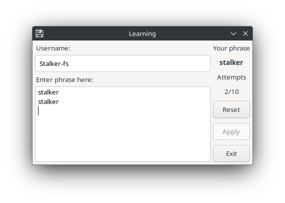
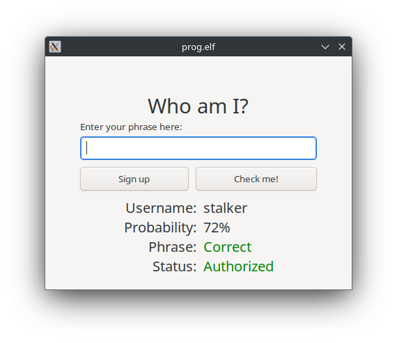

# Keystroke Dynamics Authentication System

A course project for the discipline **"Software Protection"** at **Igor Sikorsky Kyiv Polytechnic Institute**, focused on developing a user authentication system based on keystroke dynamics.

## Project Goal

To implement a biometric authentication system based on users' typing patterns (keystroke dynamics). The system distinguishes users by analyzing statistical characteristics of their typing behavior.

## Functionality

The application supports two main modes:

### Training Mode

- Users type a predefined control phrase (at least 10 times).
- The system calculates and stores:
  - Mean and variance of timing between keystrokes.
  - Results are saved in a JSON configuration file.
- Outliers in the timing data are filtered automatically.
- After training, the biometric template (mean, variance, username, and phrase) is stored for future identification.

### Authentication Mode

- User enters their phrase.
- The system:
  - Calculates statistical metrics (mean and variance) for the entered phrase.
  - Compares them against all stored biometric templates using statistical tests (Student's t-test and Fisher's F-test).
  - For each user, computes a probability score `P` based on how many statistical tests are passed.
  - **Selects the user with the highest similarity (i.e. highest `P` value)** as the most probable identity.
- Authentication is considered successful if the selected user's stored phrase matches the entered one, and `P ≥ 0.7`.

## Statistical Techniques

- **Outlier detection** using Student’s t-test
- **Variance homogeneity check** with Fisher’s F-test
- **Mean comparison** to determine the closest matching template
- **False positive/negative rate** tracking:
  - Type I error (false rejection): `P1 = 0.2857`
  - Type II error (false acceptance): `P2 = 0.4`

## Technologies

- **GTK** – graphical interface library
- **CMake** – build automation
- **JSON** – data format for template storage
- **C++** – core implementation language

## Example Use Case

1. A user registers by typing a phrase 10+ times.
2. The system learns and stores their typing style.
3. Later, the user attempts login by typing the same phrase.
4. The system verifies their identity based on timing consistency.

## 📸 Screenshots

### Training Mode

### Authentication Result

